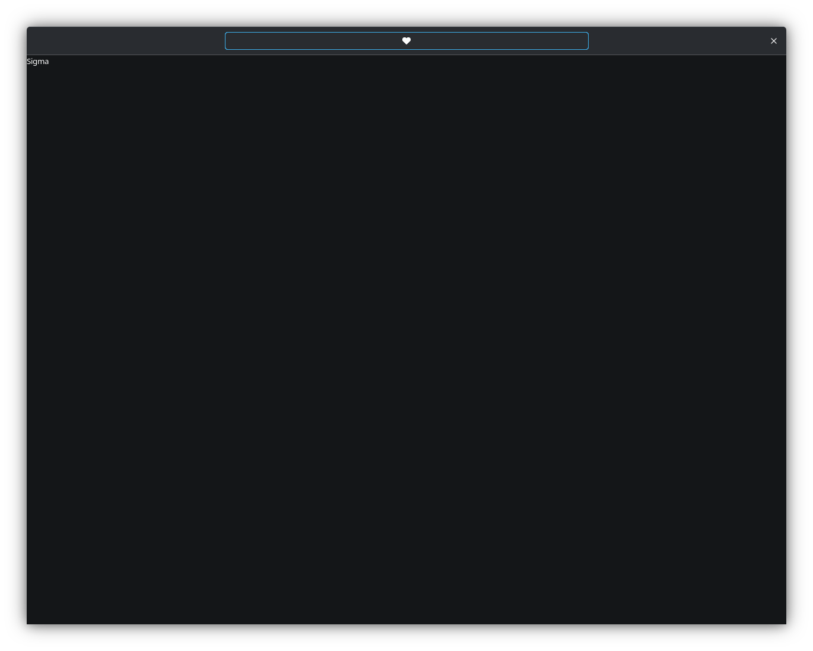

# Fifi

Fifi - simple text editor on GTK3 👣!

## Features

- 🗔 Simple UI

- 🖥️ Basic save/open functions

## Installation

You can download Fifi from [releases](https://github.com/progwi0/fifi/releases) or via [Pix](https://github.com/progwi0/pix).
