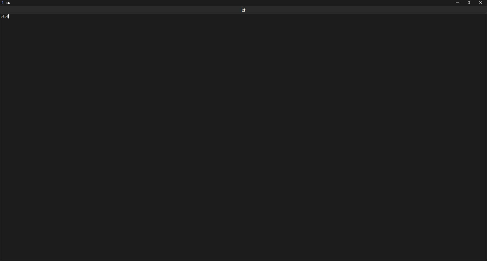

# 📝 Fifi
📝 Unlock your writing magic.

> [!IMPORTANT]
> The development of this project is FOR NOW frozen, I will unfreeze it soon.

Fifi is a simple text editor, which can run on every Windows PC!

## 🤷 Why Fifi?
1. Simple edit tools.
2. Made on Tkinter.

## 🛞 Dependencies!
For run Fifi (from source or nah) you need:
- Python 3.12+
- sv_ttk
- darkdetect
- pywinstyles

## 💿 Installation!

You can download Fifi from [releases](https://github.com/progwi0/fifi/releases) or via [Pix](https://github.com/progwi0/pix).

(i tested fifi on win11)
